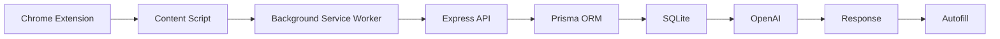
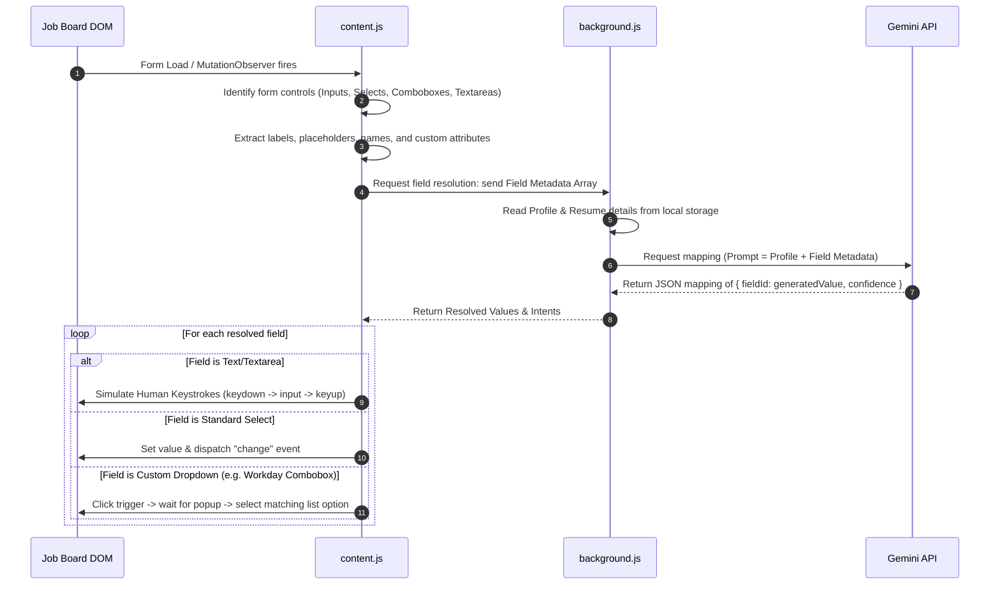
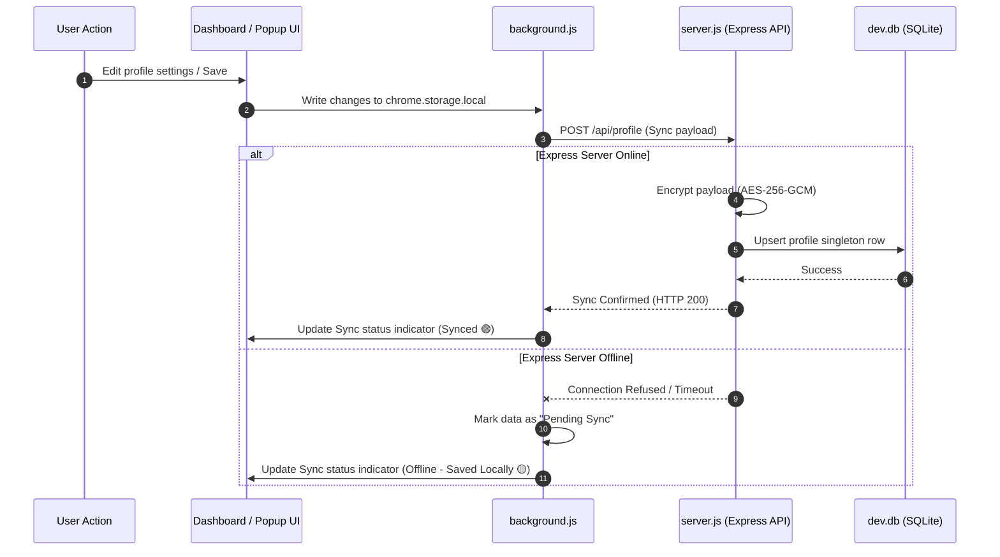
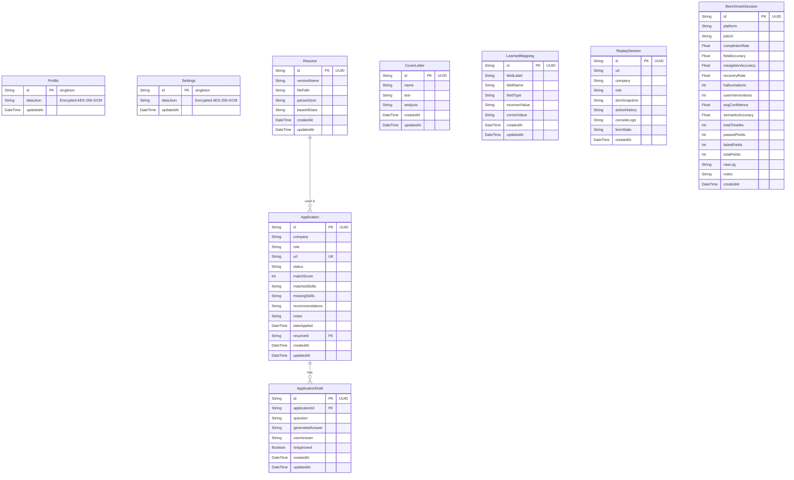

# System Design Case Study

---

## System Flow Diagram



---

### Component Explanations

#### Chrome Extension
* **Role**: The user‑facing entry point, packaged as a Manifest V3 Chrome extension. It provides UI panels (popup, side‑panel, dashboard) and injects scripts into job‑application pages.
* **Key Files**: `manifest.json`, `popup.html/js`, `sidepanel.html/js`, `dashboard.html/js`.

#### Content Script
* **Role**: Runs in the context of the job‑board page, scans the DOM, extracts form fields, and performs the actual autofill actions.
* **Features**:
  * `MutationObserver` to detect dynamically added fields.
  * Human‑typing simulation (keyboard events) to bypass anti‑bot scripts.
  * Direct interaction with custom widgets (comboboxes, dropdowns).
* **File**: `extension/content.js`.

#### Background Service Worker
* **Role**: Persistent worker that mediates communication between the content script and the backend, stores cached data, and handles API calls.
* **Functions**:
  * Message routing via Chrome runtime ports.
  * Caches the user profile and resumes in `chrome.storage.local`.
  * Invokes the LLM when semantic matching is required.
* **File**: `extension/background.js`.

#### Express API
* **Role**: A local Node.js server exposing REST endpoints that the background worker calls for persistent data operations.
* **Endpoints** include `/api/profile`, `/api/resumes`, `/api/applications`, etc.
* **File**: `backend/server.js`.

#### Prisma ORM
* **Role**: Object‑relational mapper that translates JavaScript calls into type‑safe SQL for SQLite.
* **Benefits**: Schema migrations, type‑checked queries, and easy relation handling.
* **File**: `backend/prisma/schema.prisma` and generated client.

#### SQLite
* **Role**: Embedded relational database stored locally as `dev.db`. Holds encrypted user profiles, resumes, cover letters, learned mappings, and application logs.
* **Characteristics**: Zero‑configuration, file‑based, and suitable for the MVP’s privacy‑first design.

#### OpenAI (Gemini) LLM
* **Role**: Provides semantic understanding and generation capabilities. The background worker sends field metadata and profile data, receiving a JSON mapping of field → value.
* **Why Used**: High‑quality natural‑language reasoning without needing to train a local model.
* **Integration**: Calls made directly from the background script using the stored API key.

#### Response
* **Role**: The JSON payload returned by the LLM containing the suggested values for each form field, along with confidence scores.
* **Processing**: Background worker parses the response, stores any learned mappings, and forwards the values to the content script.

#### Autofill
* **Role**: The final step where the content script populates the form fields using the human‑typing simulation and updates the UI for user review.
* **Outcome**: A fully‑filled application ready for the user to review and submit.

---

## System Design Memo

### Executive Summary
The AI Job Agent is designed around a **local‑first philosophy**:
* **Privacy & Control**: All sensitive user credentials, profiles, resumes, and cover letters are encrypted using **AES-256-GCM** and stored locally inside a SQLite database.
* **Resiliency**: The client‑side extension utilizes standard browser key‑value stores (`chrome.storage.local`) for immediate operations, decoupling application functionality from the state of the local Express backend server.
* **Intelligent Automation**: Instead of brittle, CSS‑selector‑based form filling, the agent parses page context semantically and calls the Google Gemini API to translate unstructured user resume datasets into structured form values.
* **Undetectable Simplicity**: Human keystroke emulation (injecting physical‑like keydown/keypress/keyup flows) enables compatibility with frontend frameworks (React/Vue/Angular) while bypassing basic anti‑bot profiling.

---

### System Architecture Overview
The system is separated into three primary tiers:
1. **Extension Tier (Frontend & Automation Engine)**: Orchestrated via Manifest V3.
2. **Backend Sync Tier (Local Service & Persistence API)**: Written in Express/Node.js.
3. **Database Tier (Relational Storage)**: Managed via Prisma and SQLite.

```mermaid
graph TB
    subgraph Extension Tier (Chrome Sandbox)
        CS[Content Script: content.js]
        SP[Sidepanel UI: sidepanel.js]
        DB[Dashboard Workspace: dashboard.js]
        PP[Popup Dropdown: popup.js]
        BG[Background worker: background.js]
    end

    subgraph Local Server Tier (Node.js)
        API[Express Router: server.js]
    end

    subgraph Storage Tier
        CS <--|chrome.storage.local| LS[(Browser Local Storage)]
        BG <--|chrome.storage.local| LS
        BG <--|HTTP / CORS| API
        API <--|Prisma client| SQLite[(SQLite Database: dev.db)]
    end

    %% Communication Loops
    CS <--|Port Messaging / Events| BG
    SP <--|Port Messaging / Events| BG
    DB <--|Runtime Messages| BG
```

---

### Sequence Diagrams
#### 1. Form Scanning & Automated Semantic Filling


#### 2. Local‑First Background Sync Sequence


---

### Relational Database Schema Model
The database is built on SQLite for zero‑configuration, local‑first deployment. The relationships between models are defined in `schema.prisma`:


---

#### Deep Dive: Core Automation Mechanisms
##### Human Typing Simulation
Standard browser values set via `input.value = "John"` bypass the React/Angular/Vue internal shadow‑DOM descriptors, resulting in blank fields when forms are submitted. To counter this, `content.js` uses a sequential dispatch method:
```javascript
async function simulateHumanType(element, value) {
  element.focus();
  element.value = '';
  for (let i = 0; i < value.length; i++) {
    const char = value[i];
    const keyOpts = { key: char, keyCode: char.charCodeAt(0), bubbles: true };
    element.dispatchEvent(new KeyboardEvent('keydown', keyOpts));
    element.dispatchEvent(new KeyboardEvent('keypress', keyOpts));
    element.value += char;
    element.dispatchEvent(new Event('input', { bubbles: true }));
    element.dispatchEvent(new KeyboardEvent('keyup', keyOpts));
    await new Promise(r => setTimeout(r, Math.random() * 40 + 10));
  }
  element.dispatchEvent(new Event('change', { bubbles: true }));
  element.blur();
}
```

##### Learned Mappings (Adaptive Learning Loop)
When a user overrides a pre‑filled field with their own value, the extension records the deviation. On submit, this correction is sent to the backend as a `LearnedMapping`. Future queries on similar labels evaluate these learned overrides first, enabling self‑correcting semantic profiles without modifying the main JSON profile repeatedly.

##### Diagnostics & Replay System
To capture error states, the extension records a `ReplaySession` when field fills fail. It logs:
* A complete DOM Snapshot (captured at the moment of failure)
* User action trace logs
* Browser console output summaries
Developers can restore these snapshots in a sandboxed, simulated page environment to diagnose scraping, layout, or event handler problems safely.

---

### Security & Credential Isolation
* **Encryption**: Symmetric key encryption is handled at the server layer (`server.js`) using `aes-256-gcm`.
* **Key Derivation**: The decryption secret is derived using `crypto.scryptSync` with a salt based on the client session username and password.
* **Isolation**: The Gemini API Key is never sent to third‑party endpoints. Communication happens directly from the Chrome Extension client background context or the local loopback server to Google API endpoints.

---
